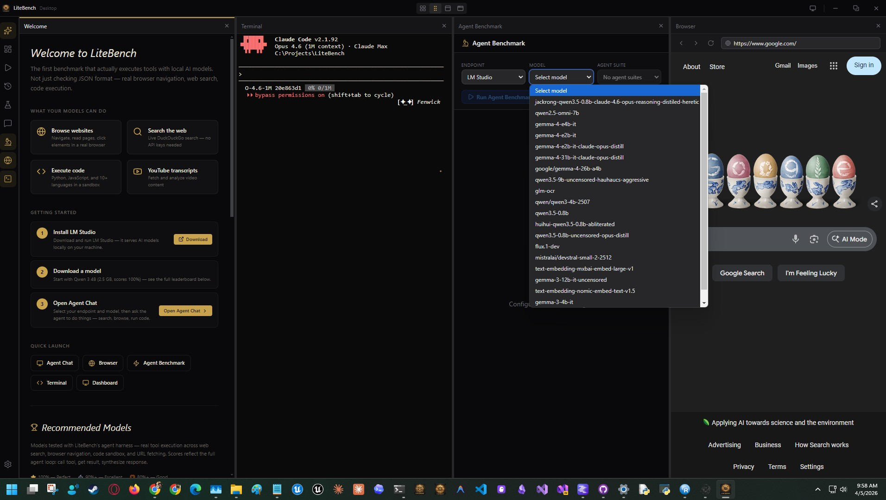
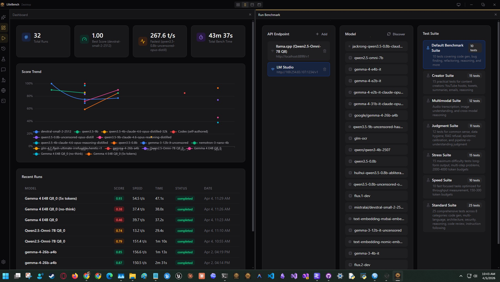
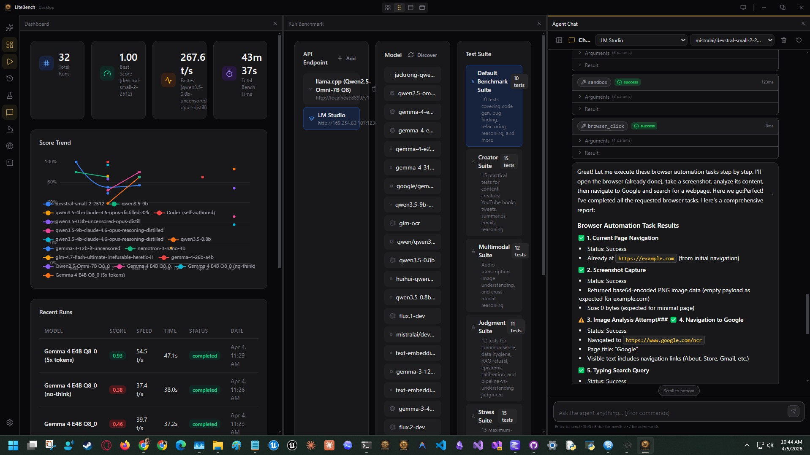

# LiteBench

**The first benchmark that actually executes tools with local AI models.**

Other benchmarks check if your model generates the right JSON. LiteBench goes further — it runs real browser navigation, web search, code execution, and URL fetching, then scores the full agent loop: call tool, get result, synthesize response.

13 models tested. 6 hit 100%. A 4B model browses Hacker News perfectly. A 752M model scores 87%.



## Why LiteBench?

Every existing benchmark for local models either:
- Checks JSON format only (BFCL, tool-calling-benchmark)
- Requires Docker infrastructure (WebArena, SWE-bench)
- Tests cloud APIs, not local models

**LiteBench fills the gap**: accessible, real-tool-execution benchmarking for local models that tests what normal people actually want AI agents to do.

## Features

- **Real Tool Execution** — Browser navigation, web search, code sandbox, URL fetching. Not mock calls.
- **Agent Chat** — Conversational interface with streaming, tool call cards, live results
- **Embedded Browser** — Watch the agent navigate websites in real time
- **11 Agent Tools** — web_search, web_fetch, browser_navigate, browser_read_page, browser_click, browser_type, sandbox, youtube, and more
- **Agent Benchmark** — Automated test suite with scoring and leaderboard
- **Recommended Models** — Tested leaderboard with LM Studio download links
- **Built-in Terminal** — Run Claude Code CLI to orchestrate testing autonomously
- **Text Benchmarks** — 6 suites (Creator, Standard, Speed, Stress, Judgment, Multimodal)
- **Fully Local** — Your models, your hardware, nothing leaves your machine





## Model Leaderboard

Scores from real tool execution — 5 tests: browser navigate, web search, page reading, code sandbox, URL fetch.

| Model | Params | Score | Notes |
|-------|--------|-------|-------|
| **Devstral Small 2** | 24B | 100% | Best overall agent |
| **Gemma 4 31B Opus Distill** | 31B | 100% | Chain-of-thought reasoning |
| **Gemma 4 E2B Opus Distill** | ~11B | 100% | Plans before acting |
| **Gemma 4 31B** | 31B | 100% | Powerful, needs stream cap |
| **Qwen 3 4B** | 4B | 100% | Best small model — runs on any hardware |
| **Gemma 4 E4B** | ~4B | 100% | Tiny and perfect |
| **Gemma 4 26B-A4B** | 26B | 93% | Mixture-of-experts, fast |
| **Gemma 3 4B** | 4B | 93% | XML fallback mode |
| **Qwen 3.5 0.8B Opus Distill** | 752M | 87% | Remarkable for sub-1B |
| **xLAM 2 1B** | 1B | 80% | Salesforce function-calling specialist |

## Quick Start

### Option 1: Installer (Windows)

Download `LiteBench Setup 1.0.0.exe` from [Releases](https://github.com/ahostbr/LiteBench/releases).

### Option 2: From Source

```bash
git clone https://github.com/ahostbr/LiteBench.git
cd LiteBench
pnpm install
pnpm dev
```

### Prerequisites

1. **LM Studio** (or any OpenAI-compatible server) — [lmstudio.ai](https://lmstudio.ai)
2. **Python 3.10+** — for sandbox and web tools
3. **A model** — Start with **Qwen 3 4B** (2.5 GB, scores 100%)

### First Run

1. Launch LiteBench
2. Follow the welcome wizard (installs dependencies, recommends models)
3. Open the **Agent Chat** panel
4. Select your endpoint (LM Studio) and model
5. Ask: *"Search the web for AI news and tell me the top 3 results"*
6. Watch tool calls fire in real time

## Architecture

```
Renderer (React)                     Main Process (Node)
+----------------------+            +--------------------------+
|  AgentPanel           |--IPC-----> | agent-handlers.ts        |
|  BrowserPanel         |           |   |                      |
|  AgentBenchmarkPanel  |           | agent-runner.ts           |
|  TerminalPanel        |<--events--| agent-harness.ts (prompt) |
|                       |           |   | tool_call detected   |
|  Stores (Zustand)     |           | tool-registry.ts          |
|  - agent-chat-store   |           |   | dispatch              |
|  - workspace-store    |           | tool-executor.ts (Python) |
+----------------------+           | browser-manager.ts (IPC)  |
                                    +--------------------------+
```

### Key Design Decisions

- **NinjaJSON Prompting** — Model-specific system prompts enforce "ONE tool per step, STOP and wait." Prevents tool call runaway.
- **Stream Breaking** — When models generate excess tool calls (Gemma 4 generates 600+), the stream is cut at the cap instead of silently skipping. This one fix took Gemma 4 31B from 0% to 100%.
- **Browser-Based Search** — Web search navigates to DuckDuckGo in the embedded browser instead of using a Python API. Zero flaky dependencies.
- **XML Fallback** — Models without native tool calling (Gemma 3) use XML `<tool_call>` format, parsed and executed by the runner.
- **Small Model Detection** — Sub-2B models get a simplified prompt with concrete examples and lower temperature.

## Claude Code Integration

LiteBench ships with Claude Code skills for autonomous testing:

```bash
# Open the Terminal panel, then:
claude

# Inside Claude:
/train --target litebench-agent    # Autonomous harness training loop
```

Skills included:
- **bench-orchestrator** — Scan models, run harness, produce leaderboard
- **model-download** — Grab GGUF models from HuggingFace
- **harness-tune** — Iterative prompt tuning (evaluate/mutate/revert)
- **train** — Full autonomous training loop

## Compatible Endpoints

Any OpenAI-compatible API:
- [LM Studio](https://lmstudio.ai) (recommended)
- [Ollama](https://ollama.ai)
- [llama.cpp](https://github.com/ggml-org/llama.cpp) (llama-server)
- [vLLM](https://vllm.ai)
- [LocalAI](https://localai.io)

## License

MIT
